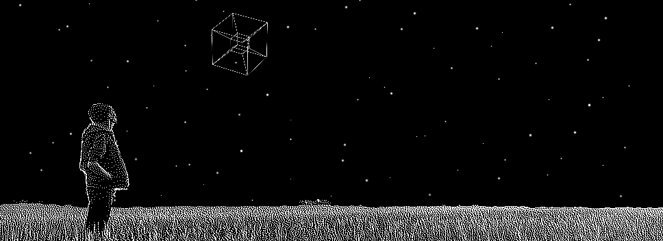

<picture>
 <source media="(prefers-color-scheme: dark)" srcset="./banner/light_banner.gif">
 <source media="(prefers-color-scheme: light)" srcset="./banner/dark_banner.gif">
 
</picture>

Check out the alternatve theme banner ([dark](https://www.github.com/GCBallesteros/GCBallesteros/tree/main/banner/dark_banner.gif)/[light](https://www.github.com/GCBallesteros/GCBallesteros/tree/main/banner/light_banner.gif)) by switching Github themes or have a look a how I [procedurally generated them](https://github.com/GCBallesteros/GCBallesteros/tree/main/banner)!

I'm a Data Scientist and Scientific Software Developer with a knack for
optimization. I enjoy it the most when I work where engineering and software
development intersect. In my free time you will find me learning new
programming languages, implementing fancy algorithms, playing music, enjoying
nature and tweaking my neovim config.

Currently I'm a Senior Data Scientist (and more) @ [Kuva Space](www.kuvaspace.com)
helping build a constellation of hyperspectral cubesats

- Other places to find me:
  - 🌐 Blog: [Maxwell Rules](https://www.maxwellrules.com)
  - 🎓 Publications: [Google Scholar](https://scholar.google.co.uk/citations?hl=es&user=ky87HY0AAAAJ&view_op=list_works&sortby=pubdate)
  - 📧 dev &lt;at&gt; maxwellrules.com

### Open Source Projects 

Total ⭐: 388

#### Scientific algorithms (Σ⭐=30)
  - [readPTU](https://www.github.com/QuantumPhotonicsLab/readPTU) (⭐ 17):  Code developed during my PhD to analyze multi-GB photon correlation experimental data very quick. [Check the paper!](https://iopscience.iop.org/article/10.1088/1748-0221/14/06/T06011/meta)
  - [trattoria](https://www.github.com/GCBallesteros/trattoria) (⭐ 6):  Python wrapper for the fastest streaming algorithms for your TTTR data
  - [tttr-toolbox](https://www.github.com/GCBallesteros/tttr-toolbox) (⭐ 3):  The rust-y core of the Trattoria. Blazingly fast streaming algorithms to analyze TTTR experimental data
  - [foureg](https://www.github.com/GCBallesteros/foureg) (⭐ 2):  GPU/Pytorch reimplementation of matejak/imreg focusing on performance and production-ready features
  - [TransferMatrixMethod](https://www.github.com/GCBallesteros/TransferMatrixMethod) (⭐ 2):  A fast and compact implementation of the old and trustworthy Transfer Matrix Method to analyze optical multilayer structures
  - ... and more

#### Neovim (Σ⭐=319)
  - [NotebookNavigator.nvim](https://www.github.com/GCBallesteros/NotebookNavigator.nvim) (⭐ 202):  VSCode style code cells for neovim and functions to manipulate them
  - [jupytext.nvim](https://www.github.com/GCBallesteros/jupytext.nvim) (⭐ 88):  Edit jupyter notebooks from the comfort of neovim with the power of [jupytext](https://github.com/mwouts/jupytext)
  - [vim-textobj-hydrogen](https://www.github.com/GCBallesteros/vim-textobj-hydrogen) (⭐ 28):  An extension to vim-textobj to add code cell objects
  - [machinegun.nvim](https://www.github.com/GCBallesteros/machinegun.nvim) (⭐ 1):  A plugin to make it easy to write multi-user/machine configurations
  - ... and more
