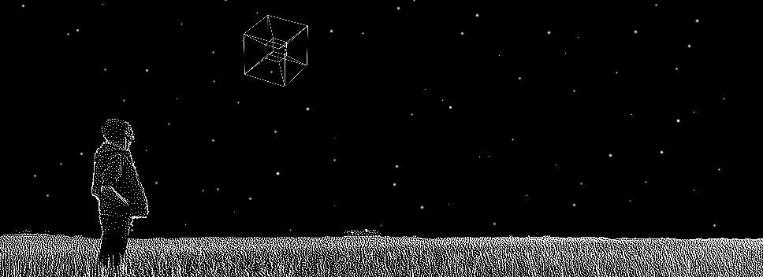

<picture>
 <source media="(prefers-color-scheme: dark)" srcset="./banner/light_banner.gif">
 <source media="(prefers-color-scheme: light)" srcset="./banner/dark_banner.gif">
 
</picture>

Check out the alternatve theme banner ([dark](https://www.github.com/GCBallesteros/GCBallesteros/tree/main/banner/dark_banner.gif)/[light](https://www.github.com/GCBallesteros/GCBallesteros/tree/main/banner/light_banner.gif)) by switching Github themes or have a look a how I [procedurally generated them](https://github.com/GCBallesteros/GCBallesteros/tree/main/banner)!

I'm a Data Scientist and Scientific Software Developer with a knack for
optimization. I enjoy it the most when I work where engineering and software
development intersect. In my free time you will find me learning new
programming languages, implementing fancy algorithms, playing music, enjoying
nature and tweaking my neovim config.

Currently I'm a Senior Data Scientist (and more) @ [Kuva Space](www.kuvaspace.com)
helping build a constellation of hyperspectral cubesats

- Other places to find me:
  - 🌐 Blog: [Maxwell Rules](https://www.maxwellrules.com)
  - 🎓 Publications: [Google Scholar](https://scholar.google.co.uk/citations?hl=es&user=ky87HY0AAAAJ&view_op=list_works&sortby=pubdate)
  - 📧 dev &lt;at&gt; maxwellrules.com

### Open Source Projects 

Total ⭐: {{total_stars}}

#### Scientific algorithms (Σ⭐={{science_stars}})
  
  - [{{repo.name}}](https://www.github.com/{{repo.owner}}/{{repo.name}}) (⭐ {{repo.stars}}): {{badges[repo.lang]}} {{repo.description}}
  
  - ... and more

#### Neovim (Σ⭐={{vim_stars}})
  
  - [{{repo.name}}](https://www.github.com/{{repo.owner}}/{{repo.name}}) (⭐ {{repo.stars}}): {{badges[repo.lang]}} {{repo.description}}
  
  - ... and more

###  As seen on Hacker News  

- [Homographies: Looking through a pinhole](https://www.maxwellrules.com/math/looking_through_a_pinhole.html) - [HN Discussion](https://news.ycombinator.com/item?id=37347903)
- [Extending Python with Rust](https://maxwellrules.com/programming/rusty-python.html) - [HN Discussion](https://news.ycombinator.com/item?id=34145691)
- [I have reached Vim nirvana](https://www.maxwellrules.com/misc/nvim_jupyter.html) - [HN Discussion](https://news.ycombinator.com/item?id=34145680)
